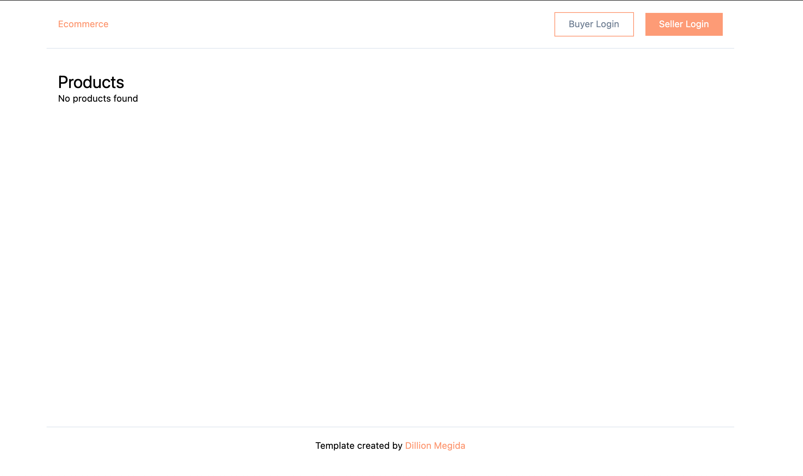
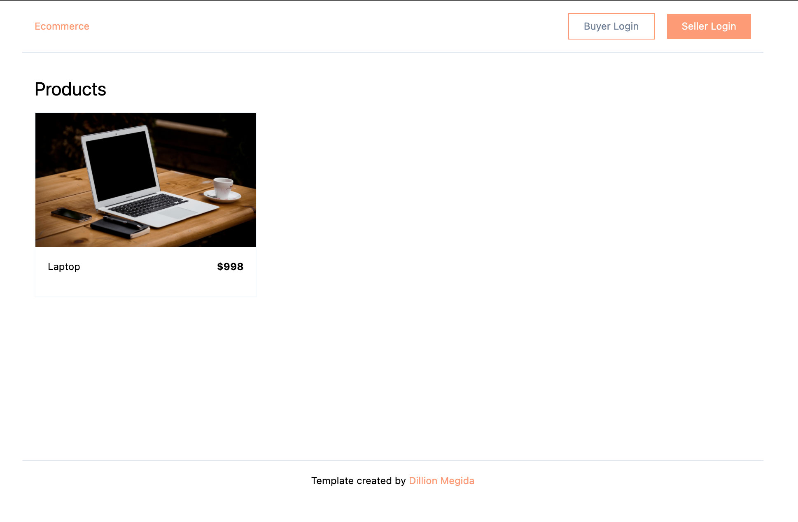
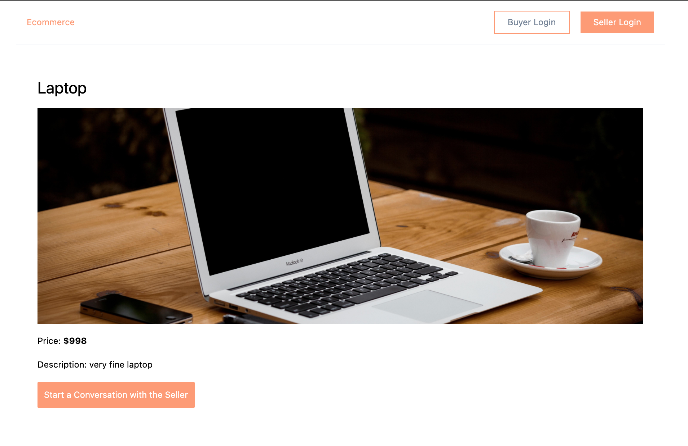
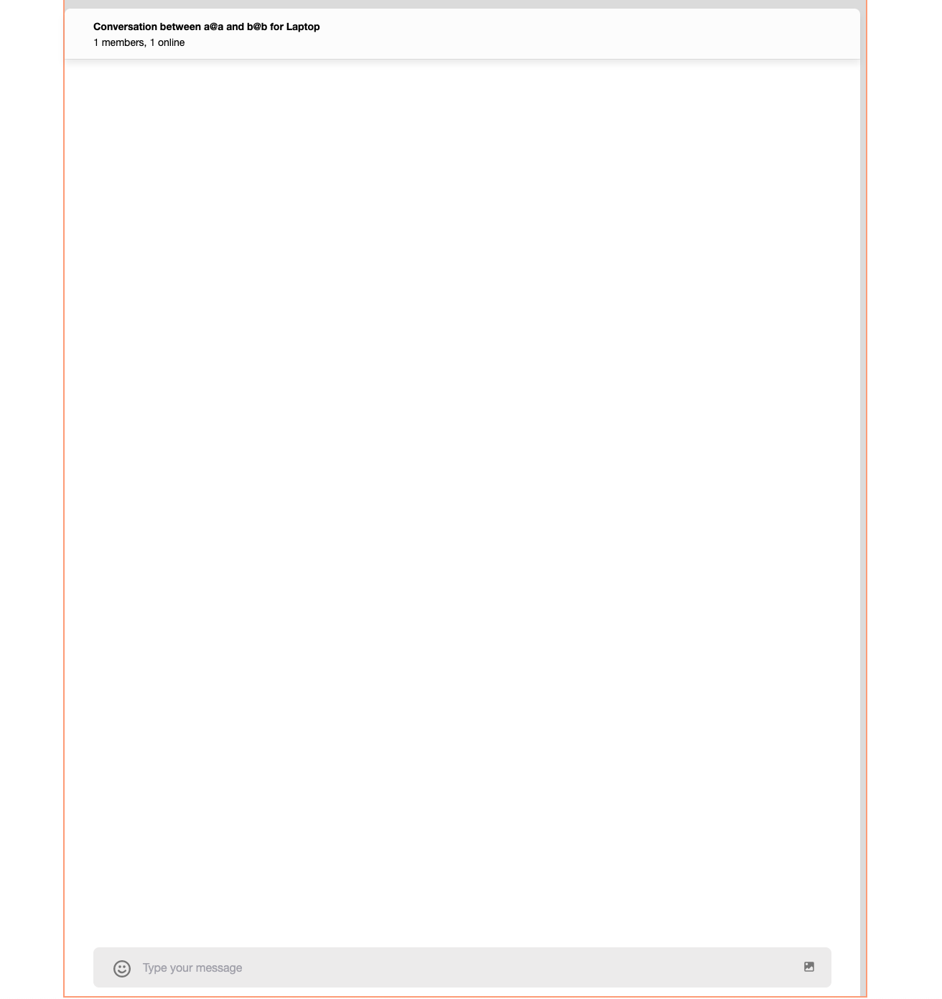
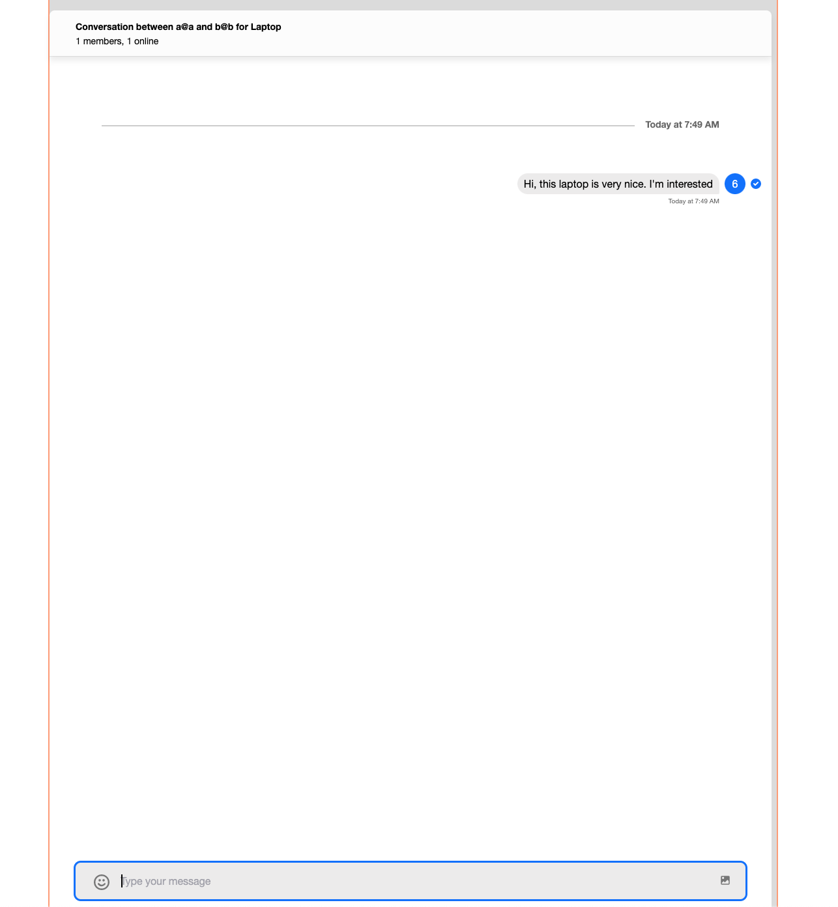
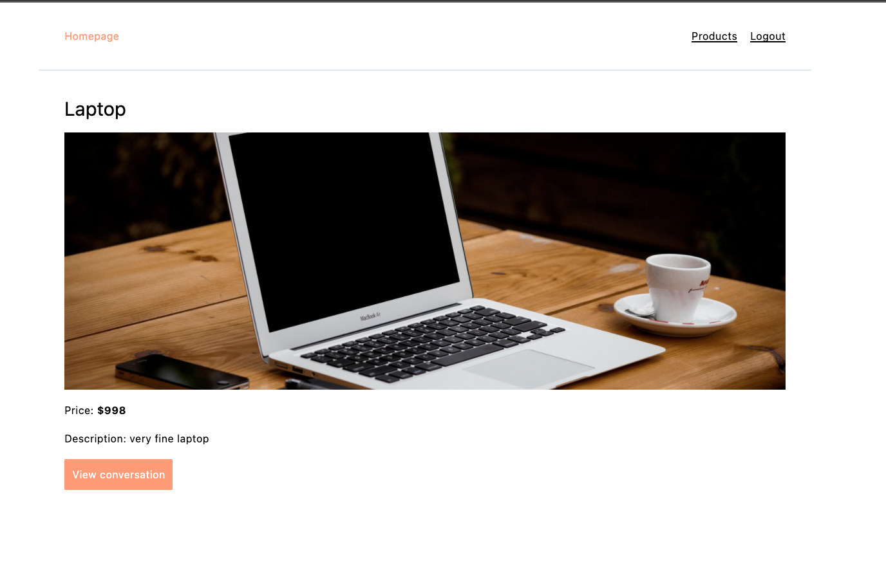
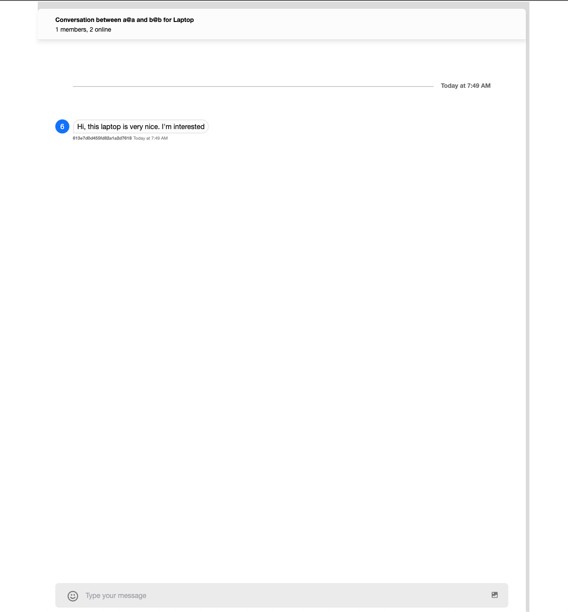
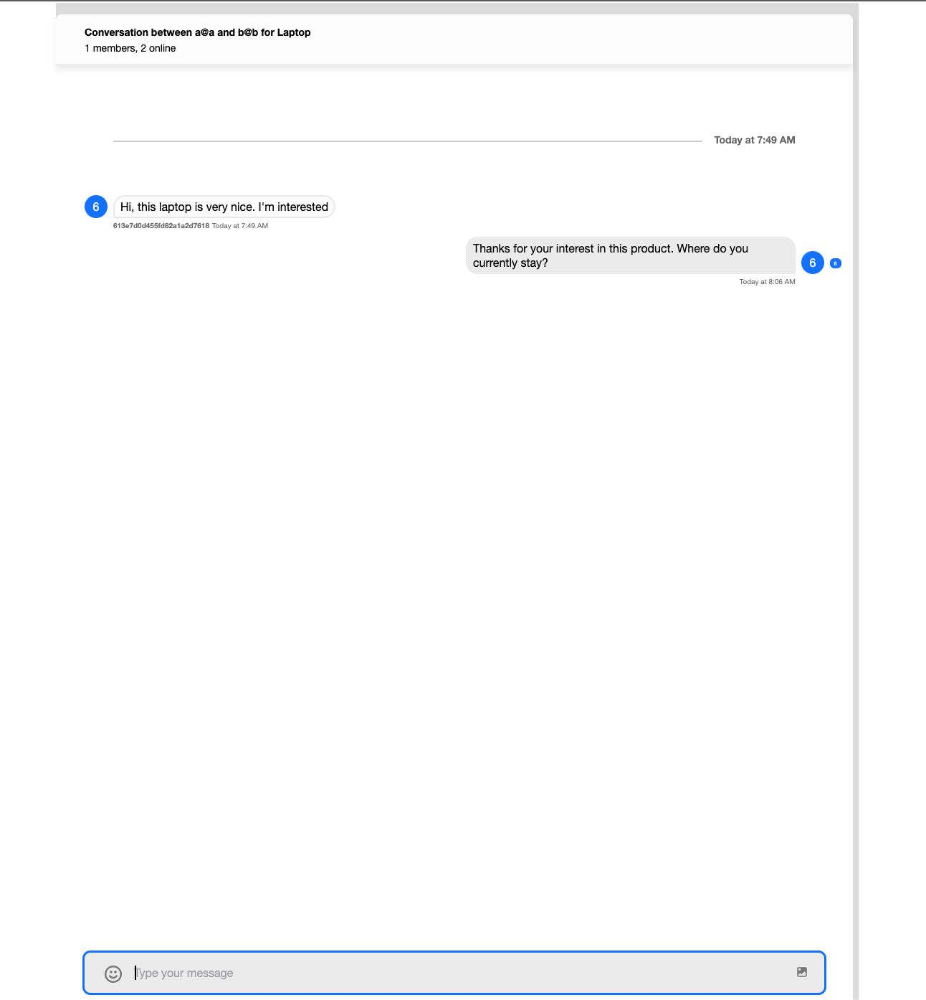
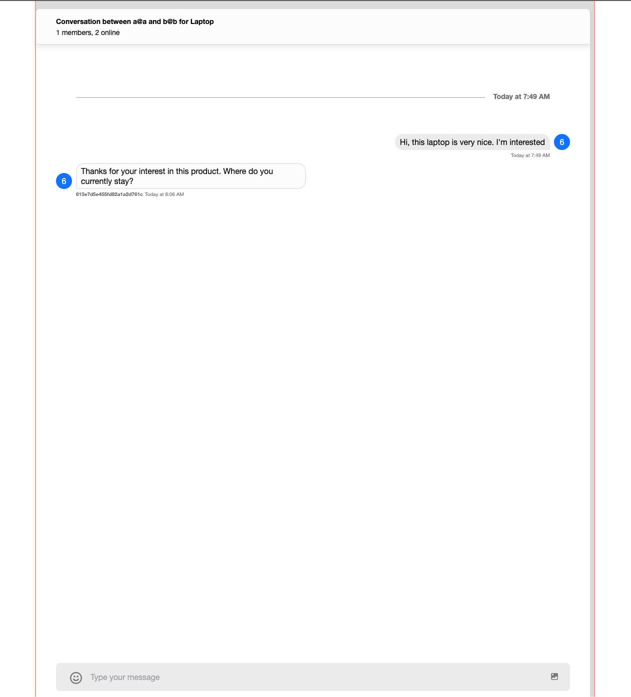

# How to Integrate Stream into an E-commerce application for supporting Buyer-Seller Communication

E-commerce applications are platforms that allow sellers to sell their products and buyers to buy products from the sellers. In this article, we will learn how to integrate [the React SDK for Stream](https://getstream.io/chat/sdk/react/) into an existing E-commerce application for supporting conversations between buyers and sellers.

We'll be building this application using this Next.js e-commerce template as our starting point: [ecommerce-nextjs-mongodb](https://github.com/dillionmegida/ecommerce-nextjs-mnogodb). The template uses Next.js for managing the frontend and backend environments, with MongoDB serving as the database.

## Requirements

You must have a Stream Account to use Stream. If you don't have one, you can [sign up for one](https://getstream.io/try-for-free/).

You also need to have MongoDB installed locally. You can install it with [MongoDB Community Edition](https://docs.mongodb.com/manual/administration/install-community/). Also, ensure that you have the MongoDB service running on your machine.

Also downloaded [MongoDB Compass](https://www.mongodb.com/try/download/compass) which would serve as a GUI for viewing and managing your MongoDB database.

Lastly, you'll need to have Node.js installed locally. You can install it with [Node.js](https://nodejs.org/en/).

## Prerequisites

To get a better understanding of this article, familiarity with MongoDB, creating models and schemas, and Next.js is required.

## Contents

- [What is Stream?](#what-is-stream)
- [Brief overview of Next.js](#brief-overview-of-nextjs)
- [Running the E-commerce app](#running-the-e-commerce-app)
  - [Connecting the database](#connecting-the-database)
  - [Adding Environment Variables](#adding-environment-variables)
- [Building the Backend](#building-the-backend)
  - [Creating the conversation model](#creating-the-conversation-model)
  - [Creating the conversation APIs](#creating-the-conversation-apis)
    - [The start conversation API](#the-start-conversation-api)
    - [The get conversations API](#the-get-conversations-api)
- [Building the Frontend](#building-the-frontend)
  - [Setting up Stream](#setting-up-stream)
  - [Quering the APIs](#quering-the-apis)
  - [Integrating the chat SDK in the pages](#integrating-the-chat-sdk-in-the-pages)
- [Deployment](#deployment)
- [Conclusion](#conclusion)

## What is Stream?

Stream is a messaging product that provides all of your messaging needs. From Threads to one-on-one conversations, to channels, to groups, Stream supports all of it.

Stream also provides many SDKs that allow you to integrate with your existing applications. For example, in this tutorial, we'll be integrating the React SDK.

## Brief overview of Next.js

Next.js is a React-based framework that supports server-side rendering for building applications. Added to this, Next.js also supports backend environments that allow you to create APIs that your frontend can call.

In the rest of this article, we'll see how to create APIs and integrate MongoDB with Next.js.

## Running the E-commerce app

To view the result of the template, you'll need to run the following command:

```bash
# clone the template
git clone git@github.com:dillionmegida/ecommerce-nextjs-mnogodb.git
# cd into the project directory
cd ecommerce-nextjs-mnogodb
# install dependencies
npm install
```

Before running the server, we need to provide some environment variables.

Rename the `.env.local.example` file to `.env.local` and add the following environment variables:

```bash
MONGODB_URI=

JWT_SECRET_KEY=
```

### Connecting the database

To get your `MONGODB_URI`, open the MongoDB Compass application, and click on "Connect" This will create a connection to the database at `http://localhost:27017` host.

At the bottom, you will see an "Add Database" button. Click on it, and enter the name of the database you want to use. For this tutorial, I will use "stream-e-commerce". And for the "Collection Name", I will use "products". Then click on "Create Database".

### Adding Environment Variables

Now, your `MONGODB_URI` is `mongodb://localhost:27017/stream-ecommerce`.

The `JWT_SECRET_KEY` variable should be set to a secret key that is used to sign the JWT tokens. You can use any string for this.

Now, run your development server:

```bash
npm run dev
```

The development server is live on `http://localhost:3000`:



You can create a seller account and also add products to see this page populated.

## Building the Backend

The template we're using already has the backend setup. But let's briefly look at one important file:

- `server/middlewares/database.ts`:

```typescript
import mongoose from 'mongoose'

const uri = process.env.MONGODB_URI

async function databaseMiddleware(req, res, next) {
  await mongoose.connect(uri)
  return next()
}

export default databaseMiddleware
```

This is a middleware that is used on every API to ensure connection to the database. This is required before models can make changes to the DB. You can see how the models are used in `pages/api/product/index.ts` to create a product and get all products.

### Creating the conversation model

To proceed, let's create a `Conversation` model. In the `server/models` directory, create a `conversation.model.ts` file with the following code:

```typescript
import mongoose, { Schema } from 'mongoose'

const Conversation = new Schema({
  _id: String,
  product_id: {
    type: Schema.Types.ObjectId,
    ref: 'Product',
    required: true,
  },
  buyer_id: {
    type: Schema.Types.ObjectId,
    ref: 'Buyer',
    required: true,
  },
  seller_id: {
    type: Schema.Types.ObjectId,
    ref: 'Seller',
    required: true,
  },
})

export default mongoose.models.Conversation || // incase the model is already defined
  mongoose.model('Conversation', Conversation, 'conversations')
```

This model manages the conversation between a buyer and a seller on a product.

> When you define a model and attempt to use it twice, you'll get an error, stating multiple definitions of the model. This is because Next.js has already compiled the previous model, and it is attempted to be defined again. To avoid this, we check using:
> mongoose.models.Conversation ||
> mongoose.model(
> 'Conversation',
> Conversation,
> 'conversations'
> )

### Creating the conversation APIs

We'll create two APIs:

- one for starting a conversation, which will be initiated by the buyer
- and the second for getting all conversations on a particular product, meant for the seller's view


#### The start conversation API

For this API, in the `pages/api` directory, create a `conversation/index.ts` file with the following code:

```typescript
import { StatusCodes } from '@enums/StatusCodes'
import nc from 'next-connect'
import { Mongoose } from 'mongoose'
import databaseMiddleware from 'server/middlewares/database'
import isAuthenticated from '@middlewares/isAuthenticated'
import conversationModel from 'server/models/conversation.model'
import { nanoid } from 'nanoid'

const handler = nc()
  .use(databaseMiddleware, isAuthenticated)
  .post(async (req, res) => {
    const { product_id, seller_id } = req.body

    try {
      const existingConversation = await conversationModel.findOne({
        product_id,
        seller_id,
        buyer_id: req.user._id,
      })

      const channelId = existingConversation?._id || nanoid()

      if (!existingConversation) {
        await conversationModel.create({
          _id: channelId,
          product_id,
          seller_id,
          buyer_id: req.user._id,
        })
      }

      res.json({
        convo: {
          channelId,
        },
      })
    } catch (err) {
      res
        .status(StatusCodes.INTERNAL_SERVER_ERROR)
        .json({ message: 'Unable to start a conversation at the moment' })
    }
  })

export default handler
```

Using [`next-connect`](https://www.npmjs.com/package/next-connect) (an API routing middleware for Next.js), we've created a `handler` that will be used to handle the API. The handler also uses the `isAuthenticated` middleware to verify that a buyer is authenticated.

We check for an existing conversation by looking for a conversation with the same product, seller, and buyer. If there is an existing conversation, we return the channel ID (which is the `_id` of the conversation). If there isn't an existing conversation, we create a new conversation and return the channel ID. This channel ID is required by Stream to create unique channels for each conversation. We'll see that later in the article

#### The get conversations API

For this API, in the `pages/api` directory, create a `conversation/[product_id].ts` file with the following code:

```typescript
import { StatusCodes } from '@enums/StatusCodes'
import nc from 'next-connect'
import { Mongoose } from 'mongoose'
import databaseMiddleware from 'server/middlewares/database'
import isAuthenticated from '@middlewares/isAuthenticated'
import conversationModel from 'server/models/conversation.model'

const handler = nc()
  .use(databaseMiddleware, isAuthenticated)
  .get(async (req, res) => {
    const { product_id } = req.query

    try {
      const conversations = await conversationModel.find({
        product_id: product_id as string,
        seller_id: req.user._id,
      })

      if (!conversations.length)
        return res
          .status(StatusCodes.NOT_FOUND)
          .json({ message: 'There are no conversations for this product' })

      res.json({
        convos: conversations,
      })
    } catch (err) {
      res
        .status(StatusCodes.INTERNAL_SERVER_ERROR)
        .json({ message: 'Unable to fetch conversations at the moment' })
    }
  })

export default handler
```

This API will retrieve all conversations that different buyers have made for a particular product.

## Building the frontend

### Setting up Stream

First, we need to install the dependencies for Stream. Run the following code:

```bash
npm install stream-chat stream-chat-react
```

First, let's create a stream utility file. Create a new file `src/utils/stream.ts` with the following code:

```typescript
import { StreamChat } from 'stream-chat'

export const chatClient = StreamChat.getInstance(
  process.env.NEXT_PUBLIC_STREAM_API_KEY
)
```

Basically, we're creating a new instance of StreamChat and passing in the API key.

You need to add this API key to your `.env.local` file which you can get from [the Stream Dashboard](https://dashboard.getstream.io/dashboard).

Then you have to restart your server so that the new env variable is available.

Next, add the stylesheet Stream needs to display the chat. Add the following to import to `_app.tsx`:

```typescript
import 'stream-chat-react/dist/css/index.css'
```

### Querying the APIs

Next, we'll add the `startConversation` query to `src/queries/startConversation.ts`:

```typescript
import axios from 'axios'
import { authHeader } from 'src/utils/cookie'

export default function startConversation({ product_id, seller_id }) {
  return axios({
    method: 'POST',
    url: '/api/conversation',
    headers: {
      ...authHeader,
    },
    data: {
      product_id,
      seller_id,
    },
  })
}
```

And also add the `getConversations` query to `src/queries/getConversations.ts`:

```typescript
import axios from 'axios'
import { authHeader } from 'src/utils/cookie'

export default function getConversations({ product_id }) {
  return axios({
    method: 'GET',
    url: `/api/conversation/${product_id}`,
    headers: {
      ...authHeader,
    },
    data: {
      product_id,
    },
  })
}
```

### Integrating the chat SDK in the pages

First, let's use the SDK when the buyer starts a conversation.

Go to the `pages/product/[id].tsx` file. First, add the following imports:

```jsx
import {
  Chat,
  Channel,
  Window,
  ChannelHeader,
  MessageList,
  MessageInput,
} from 'stream-chat-react'
import { chatClient } from 'src/utils/stream'
import getAuthBuyer from 'src/queries/getAuthBuyer'
import { toast } from 'react-toastify'
import startConversation from 'src/queries/startConversation'
```

Now, add the following code after the `useEffect` hook:

```jsx
const [loggedInBuyer, setLoggedInBuyer] = useState(null)

const [convoChannel, setConvoChannel] = useState(null)

useEffect(() => {
  getAuthBuyer()
    .then((res) => {
      setLoggedInBuyer(res.data)
    })
    .catch(() => null)
}, [])

const startConvo = async () => {
  try {
    const res = await startConversation({
      product_id: product._id,
      seller_id: product.seller._id,
    })

    const {
      convo: { channelId },
    } = res.data

    chatClient.connectUser(
      {
        id: loggedInBuyer._id,
        email: loggedInBuyer.email,
      },
      chatClient.devToken(loggedInBuyer._id)
    )

    const channel = chatClient.channel('messaging', channelId, {
      name: `Conversation between ${loggedInBuyer.email} and ${product.seller.email} for ${product.name}`,
      members: [loggedInBuyer._id],
    })

    setConvoChannel(channel)
  } catch (err) {
    toast.error('Unable to start conversation with this seller')
  }
}
```

First, we get the logged-in buyer, and then we have a `startConvo` function. When this function is called, we make a request to the existing API to retrieve the `channelId`.

Then, we connect the buyer to the stream client instance.

> Ideally, tokens for connecting users are generated on the server, and then passed to the client. However, we're using the [`devToken`](https://getstream.io/chat/docs/react/tokens_and_authentication/?language=javascript) which we can use for development purposes.

And, we create a channel with the `channelId` and the `name` of the channel.

Immediately after the description element in the code, add the following:

```jsx
...
<p className="mt-5">Description: {product.description}</p>
{loggedInBuyer && (
    <>
    {!convoChannel ? (
        <button
        onClick={startConvo}
        className="mt-5 bg-orange text-white p-3"
        >
        Start a Conversation with the Seller
        </button>
    ) : (
        <div className="mt-5 border border-orange">
        <Chat client={chatClient}>
            <Channel channel={convoChannel}>
            <Window>
                <ChannelHeader />
                <MessageList />
                <MessageInput />
            </Window>
            </Channel>
        </Chat>
        </div>
    )}
    </>
)}
```

This checks if the buyer is logged in and then checks if there is a conversation channel. If there is a conversation channel, we display the conversation. If there isn't a conversation channel, we display a button that will start a conversation.

To see this on the UI, you first have to create an account as a buyer. Head over to `localhost:3000/buyer/register` and fill out the form.

And then, on a different browser, create a seller account on `localhost:3000/seller/register` and add a product. You can get public image URLs from [https://picsum.photos/images](https://picsum.photos/images)

Going back to `localhost:3000` should look like this:

.

And clicking on the product should display this:



Since the buyer is logged in, the start conversation button is rendered. And on clicking it, we get this:



As it is now, the buyer has initiated a conversation with the seller. The conversation was also created and saved to the database. So, if the buyer comes to this page and tries to initiate a conversation again, we get the `channelID` from the previously created conversation. Now let's send our first message:



As it is now, the seller will not receive this message. That's because the seller has not yet joined the conversation. Let's add the seller to the conversation.

Go to `pages/seller/products/[id]` and add the following imports:

```typescript
import { chatClient } from 'src/utils/stream'
import getConversations from 'src/queries/getConversations'
import getAuthSeller from 'src/queries/getAuthSeller'
import {
  Chat,
  Channel,
  Window,
  ChannelHeader,
  MessageList,
  MessageInput,
} from 'stream-chat-react'
```

After the `useEffect` hook in the file, add the following:

```typescript
const [loggedInSeller, setLoggedInSeller] = useState(null)

const [conversations, setConversations] = useState([])

const [convoChannel, setConvoChannel] = useState(null)

useEffect(() => {
  if (product) {
    getConversations({ product_id: product._id })
      .then(({ data }) => setConversations(data.convos))
      .catch(() => null)
  }
}, [product])

useEffect(() => {
  getAuthSeller()
    .then((res) => {
      setLoggedInSeller(res.data)
    })
    .catch(() => null)
}, [])

const onClickViewConversation = (channelId: string) => {
  chatClient.connectUser(
    { id: loggedInSeller._id, email: loggedInSeller._email },
    chatClient.devToken(loggedInSeller._id)
  )

  // add the seller to the channel the buyer has created
  const channel = chatClient.channel('messaging', channelId)

  setConvoChannel(channel)
}
```

The first `useEffect` hook gets the conversations for the product. The second gets the data of the authenticated seller. And we have an `onClickViewConversation` function that will be called when the user clicks on the view conversation button.

Just after the product description paragraph, add the following:

```jsx
<p className="mt-5">Description: {product.description}</p>
<div className="mt-5">
    {conversations.length < 1 ? (
        <span>There are no conversations for this product</span>
    ) : (
        conversations.map((c) => (
        <div className="mb-5">
            {!convoChannel || convoChannel.id !== c._id ? (
            <button
                onClick={() => onClickViewConversation(c._id)}
                className="p-3 bg-orange text-white"
            >
                View conversation
            </button>
            ) : (
            <Chat client={chatClient}>
                <Channel channel={convoChannel}>
                <Window>
                    <ChannelHeader />
                    <MessageList />
                    <MessageInput />
                </Window>
                </Channel>
            </Chat>
            )}
        </div>
        ))
    )}
</div>
```

In this code, we check the length of the conversations array state. If it's less than one, it means there are no conversations for this product. But if it isn't, we map over the conversations and display a button to view each of them.

To view this, log in as a seller in a different browser, click on the "Products" link, and click on the product in your dashboard. You should see this:



And on clicking the view conversation button, you should see this:



Now, let's send a message to the buyer. Here's the seller's view of the message:



And here's the buyer's view of the message:



You can also create another buyer account, and then initiate a conversation with the seller on the same product. In the seller's dashboard, you'd be able to see multiple conversations.

## Conclusion

Stream solves all of your communication needs and can be integrated in many different ways. You can interact directly with their API, or you can use the available SDKs.

In this article, we've learned how to integrate Stream into an existing e-commerce application for supporting conversations between buyers and sellers on a product.
